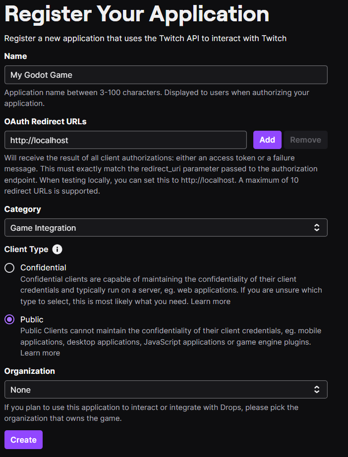

 
[](https://godotengine.org/asset-library/asset/3032)
[](https://godotengine.org)
[](LICENSE)


# Godot Very Simple Twitch
Easily connect your Godot games to Twitch chat. Log in with a single line of code to start reading messages right away. Features two docks for setting up the Twitch developer console and reading chat directly in the editor. Supports OIDC for seamless Twitch API interactions to write messages, timeout users, grant VIP status, and more.

## Table of contents
- [How to install](#how-to-install)
- [Quick setup](#quick-setup)
- [How to use](#how-to-use)
	- [Login](#how-to-login)
		- [Simple annonymous connection](#simple-anonymous-connection)
		- [Get Token and login to channel](#get-token-and-login-to-channel)
	- [Receive chat messages](#how-to-receive-chat-messages)
	- [Send chat messages](#how-to-send-chat-messages)
- [Editor Docks](#editor-docks)
	- [Very Simple Twitch](#very-simple-twitch)
	- [VstChatDock](#vst-chat-dock)
		- [Usage](#usage)
		- [Features](#features)
		- [Modifications](#modifications)
- [FAQ and Troubleshooting](#faq-and-troubleshooting)
	- [Change Settings](#change-settings)
- [License](#license)

## How to install
Godot Very Simple Twitch requires Godot 4.2 or higher. You can check the Godot version you have installed in the bottom dock or your editor.
- Clone the project or download last release.
- If you cloned the project, extract the ```addons``` folder
- Move the ```addons``` fodler to your game folder

To verify the installation is correct:
- The folder path ```res://addons/very-simple-twitch``` exists
- Go to ```Project > Project Settings```
- Click in the ``Plugins`` tab
- Enable ```Very Simple Twitch```
- Restart Godot

## Quick Setup
In order to use Very Simple Twitch, you will need to setup a new App in the Twitch developer console and perform the following steps:

1. Go to https://dev.twitch.tv/console/apps and authorize Twitch Developer to access your account.

2. Click on the "Register Your Application" button.

3. Name your application and set the Category to ``Game Integration`` and the OAuth Redirect URL to ``http:/localhost`` for now.

4. Set your ``Client Type`` to ``Public``



5. Click on "Create".

6. Open the Very Simple Twitch dock in the bottom of your Godot editor.

7. Copy the Redirect URL addresses from the Twitch Quick Start tab to your Twitch Developer App.


8. Copy the generated "Client ID" from your Twitch Developer App and add it to your TwitchOAuth gameobject


That would be all! Everything is ready to use!

## How to Use

## How to Login
### Simple anonymous connection
This is the easiest way to use the plugin. You can use ``VerySimpleTwitch.login_chat_anon("channel_name")`` to connect to the channel without needing a token or any settings customization.

```GDScript
var channel_name: String = "channel_name"

VerySimpleTwitch.login_chat_anon(channel_name)
```

### Get Token and login to channel
You can use ``VerySimpleTwitch.get_token_and_login_chat()`` to retrieve the token and automatically login to the twitch chat
```GDScript
VerySimpleTwitch.get_token_and_login_chat()
```

> Note: You will need to set up the CLIENT_ID in the Settings tab and configure the Twitch app accordingly.

## How to receive chat messages
To receive the Twitch chat messages, connect the `chat_message_received` signal from VerySimpleTwitch. The signal contains all the information available from the chatter, including display_name, badges, tags and colors.
```GDScript
func _ready():
	VerySimpleTwitch.chat_message_received.connect(print_chatter_msg)

func print_chatter_message(chatter: Chatter):
	print("Message received from %s: %s % [chatter.tags.display_name, escape_bbcode(chatter.message)])
```

## How to send chat messages
To send chat messages you can use the ``VerySimpleTwitch.send_chat_message("Hello world")`` static method. Sending chat messages is only available when you use OAuth connection method with a Token that has writting permissions.

## Editor Docks
Godot Very Simple Twitch has two docks. One at the bottom called Very Simple Twitch and one at the right called VSTChatDock. Each is used for a specific function:

* Very Simple Twitch -> Used primarily for initial setup
* VSTChatDock -> Used as a test connection with Twitch and one Twitch channel. All messages from the channel are displayed in the editor ;)

### VST Chat Dock 
As mentioned above, VST Chat Dock is a connection to the Twitch channel chat where all messages are displayed in the editor. This is useful for testing your project as it allows you to easily visualize what and when you are getting the messages. 

If you are a Godot streamer, you can read your chat in the same window you are coding in.

####  Usage

Just add and activate the plugin as explained in the installation instructions, install the plugin as usual and you'll see a new tab in the right dock named "VstChatDock". Type in the name of a channel and click connect. You will see the messages as soon as the plugin connects.


####  Features
-   The chat dock works ONLY in anonymous mode, so you don't need any authorization token, just the channel name.
-   There is a limit for saved messages. Default is 50 messages, but it can be changed in the editor settings (TBI)
-   You can delete all chat messages


## FAQ and Troubleshooting
### Change Settings
You can change the Settings in ``Project > Project Settings > General > Very Simple Twitch``. Note that switching on the ``Advanced Settings`` toggle will allow you to customize even more your client. Advanced Config are not supposed to be changed without further knowledge on how Twitch works. 

## License
This project is released under the MIT License by RothioTome (2024)
